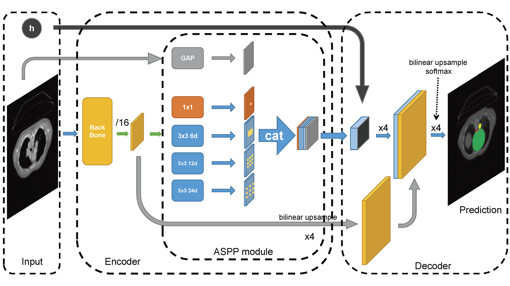

## Education

* **B.S.** in Shanghai, ShanghaiTech University, ***2015 - 2019*** 

## Work Experience
* ***2019 Jan - Present:* Computer Vision Researcher and Engineer**
  * AI Lab, Bytedance Inc.
  * Duties included: Developing frameworks, research topics in human pose transfer, video object segmentation, font effect generation(Deeplearning).
  * Supervisor: Ke Li, Yuning Jiang

* ***2016 Jul - 2016 Aug:* Web Front End Developer Intern**
	* Boonray Inc.
	* Duties included: Developing a web app to present 3D mesh models of roofs which will be built a Distributed photovoltaic power station through Three.js, including measuring roofs, simulation of placing Photovoltaic boards, automatically generating investigation report.
	* This webapp increasing 50% income than before in sales of roof-measuring-UAVs.

## Project Experience

* ***2018 Sep - 2019 Jul*: DeepLearning Method in 3D Medical Image Segmentation**
  * SIST, ShanghaiTech University
  * Designed a new framework to consider the 3d information, it provided extra embedded information in the 
    decoding module. I also considered an axis-aligned trident network. 
  * Email to [me](mailto:maoym.troy@gmail.com) for more information.
  * Supervisor: [Associate Professor Xuming He](https://xmhe.bitbucket.io/).

* ***2019 Jul - 2019 Aug*: Dynamic Font Effect Transfer**
    * AI Lab, Bytedance Inc.
    * Implemented font effect transfer algorithm individually. 
To transfer one natural dynamic effect by computing 
the nearest neighbour field of reference dynamic image
and target generated image. This work saved time for
our graphics designer and enriched our dynamic effects 
font library.
    * Supervisor: [Yuning Jiang](mailto:jiangyuning@bytedance.com)

* ***2019 Aug - Present*: Video Effect Rendering**
    * AI Lab, Bytedance Inc.
    * Developed video effects, transition effects, green-screen effects, artificial intelligence effects rendering framework, based on OpenGL, accelerated by GPU. In the process of software upgrades, I learned to deal with exceptions, avoid server stress, optimize frameworks by four revisions, and object-oriented programming. The construction of the video effects rendering framework has enabled the company's advertising business traffic to increase significantly, providing interfaces for computer vision technology access.
    * Supervisor: [Ke Li](mailto:like.niklaus@bytedance.com)

## Publications
* ***2019 Aug - Present*: Controllable Human Pose Transfer**
  * AI Lab, Bytedance Inc.
  * In proceeding to CVPR2020, if you want more details, please contact [me](mailto:maoym.troy@gmail.com).

## Skills
*  __Coding__
	* Strongly skills in Python3.6/Python2.7
	* Medium skills in R language, golang, Matlab, Arduino, JavaScript, Java.
	* Know C/C++, pointers.
* __DeepLearning Frameworks__
	* [PyTorch1.3.0](https://pytorch.org/)
	* [Tensorflow2.0](https://tensorflow.google.cn/)(Keras)
	* Numpy, OpenCV, Scikit-learn, Pandas, Matplotlib
* __Other Frameworks__
	* [The Apache Thrift software framework.](http://thrift.apache.org/)(Scalable cross-language services development, clients and servers based on Python3.6)
	* Tensorflow Serving. (Deploy a DeepLearning model on a GPU-server)
* __Other Skills__
	* Program Architecture.(See my projects in [Github](https://github.com/mtonym/pytorch-train) for insights.)
	* Multi-Processing/Threading Programing.
